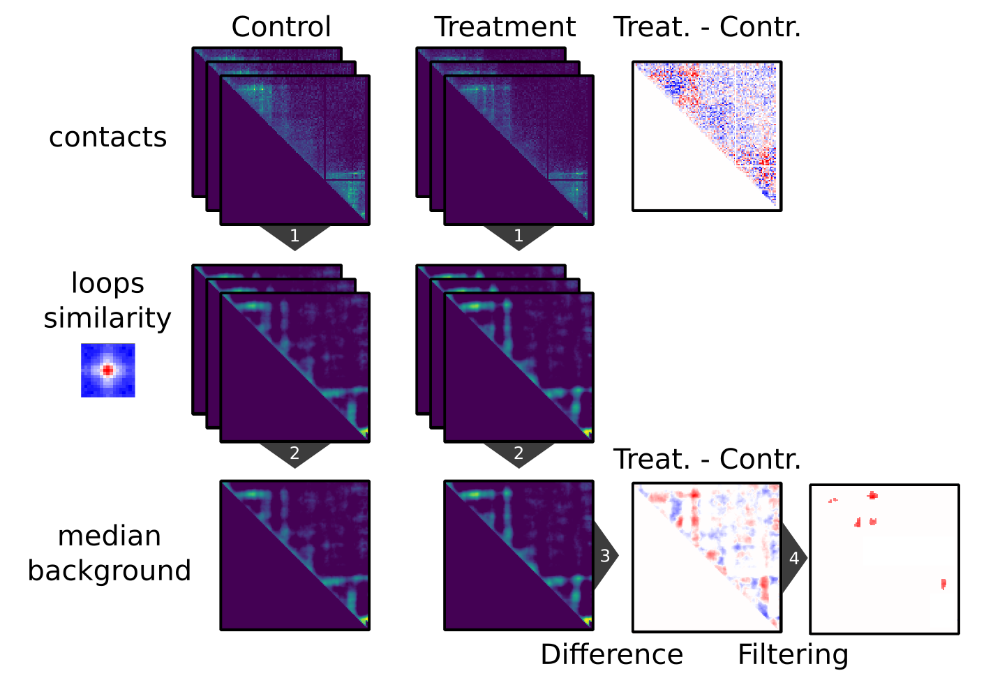

pareidolia
==========

.. image:: https://img.shields.io/pypi/v/pareidolia.svg
    :target: https://pypi.python.org/pypi/pareidolia
    :alt: Latest PyPI version

.. image:: https://github.com/koszullab/pareidolia/actions/workflows/python-package.yml/badge.svg
   :target: https://github.com/koszullab/pareidolia/actions/workflows/python-package.yml
   :alt: build

.. image:: https://codecov.io/gh/koszullab/pareidolia/branch/master/graph/badge.svg
  :target: https://codecov.io/gh/koszullab/pareidolia

Multi-sample change detection in Hi-C patterns

Pareidolia for detects changes in intensities of a specific pattern (e.g. chromatin loops and domain borders) from Hi-C maps.
It can be used to compare samples from different conditions and use multiple replicates to improve results.

This toolkit exploits `Chromosight <https://github.com/koszullab/chromosight>`_ correlation maps, allowing the same method to detect changes in different Hi-C patterns (e.g. loops or borders).

Installation
------------

Pareidolia is available on Pypi and can be installed using:

.. code:: bash

  pip3 install --user pareidolia

Usage
-----

Pareidolia can be used both as a python package and as a command line tool:

.. code-block:: python

  import pareidolia.hic_utils as pah
  pah.change_detection_pipeline(
    ["ctrl1.cool", "ctrl2.cool", "treat1.cool", "treat2.cool"],
    ["control", "control", "treatment", "treatment"],
    kernel='loops',
    subsample=True,
    n_cpus=8,
  )

We can also use the CLI to execute the same instruction:

.. code-block:: bash

  pareidolia -n 8 \
             -k loops \
             ctrl1.cool,ctrl2.cool,treat1.cool,treat2.cool \
             control,control,treatment,treatment \
             output.tsv

Pareidolia can either detect changes *de-novo*, or compute the change intensity at a set of input positions.
The input positions can be provided as a bed2d (=bedpe) file, containing a list of 2D genomic coordinates.
This file can be provided with the `--bed2d-file` option on the CLI, or using the `bed2d_file` parameter in the python API.

Padeidolia accepts chromosight kernels as kernel names. A list of valid kernels can be displayed using `chromosight list-kernels`.
Alternatively, when using the API, an arbitrary 2D numpy array can be provided as kernels.

Algorithm
---------

Pareidolia starts by running Chromosight's convolution algorithm on each input sample to compute a matrix of correlation coefficients to the target pattern. Each position represents the similarity of the region to that pattern. For each condition, a median background is generated by averaging correlation matrices from replicates.

A differential background matrix is computed by subtracting backgrounds from the different conditions. Pareidolia then applies a series of filtering steps to discard noisy regions. Three filters are applied, each with their respective threshold:

* Pearson threshold: Only regions where at least one input sample has a pearson coefficient above this threshold are considered.
* snr threshold: Signal-to-noise-ratio filter to discard regions where the intra-condition variability is low compared to the inter-condition difference.
* Density threshold: Coverage-based filter to remove very sparse regions. If the proportion of non-empty pixels used to compute the correlation score is below that threshold, the value is discarded.

Each filter can be selectively disabled, or its threshold adapted using command line options.

If a list of positions was provided, the filtered differential scores are returned at those positions. Otherwise, de-novo differential pattern detection is performed using connected component labelling on the matrix as in Chromosight.

